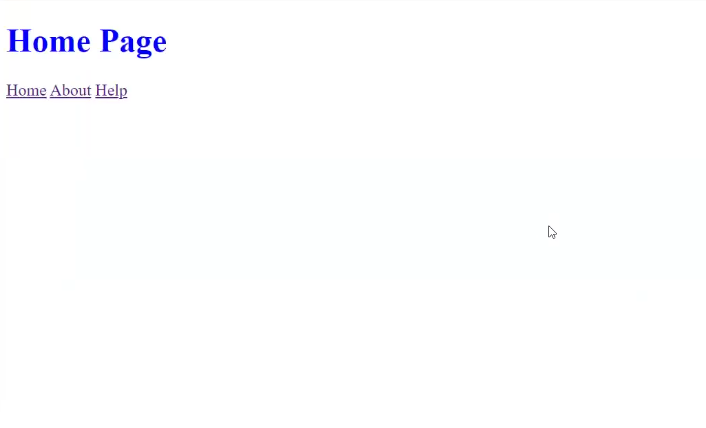

# Clase 24-27 cont... Node, Express, NPM.

## Creamos el entorno de desarrollo e instalamos las dependencias del proyecto.

1. Inicializamos Node: `node init`
2. Instalamos Express: `npm i express`
3. Instalamos nodemon: `npm i -g nodemon`
4. Instalamos Handlebars: `npm install handlebars`
5. En el archivo package.json para la propiedad `main` establecemos la dirección del archivo `app.js` como su valor.
6. En el archivo package.json para de la propiedad script crear un script para arrancar la aplicación, para esto agregar: 
	`"start": "node src/app.js`
	El comando para este script es: `node start`.
7. En el archivo package.json para de la propiedad script crear un script para arrancar nodemon, para esto agregar: 
	`"dev": "nodemon src/app.js`
	El comando para este script es: `npm run dev`

## Estructura de carpetas
Una estructura de carpetas separa los diferentes tipos de archivos del proyecto en carpetas específicas, lo que facilita la navegación y la búsqueda de archivos

- Los archivos estáticos del Front-end para el proyecto se ubican en la ruta:
```
└── public/ 
	├── css/ 
	├── html/ 
	└── js/
```

- Los archivos relacionados con el servidor se ubican en la ruta:
```
└── src/ 
	├── app.js 
	├── routes/ 
	└── controllers/
```

- Los archivos relacionados a las vistas creadas con el motor de plantillas se ubican en:
```  
└── views/  
	├── partials/ 
	└── components/
```

Luego de definir la estructura de las carpetas del proyecto pasamos a configurar el servidor con Express.js para renderizar contenido web usando plantillas generadas por un motor de plantillas, en este caso Handlebars.js

## Configurando el servidor

Trabajaremos en el archivo app.js.
El módulo node:path proporciona utilidades para trabajar con rutas de archivos y directorios[7](https://nodejs.org/docs/latest/api/path.html).  Se puede acceder a el usando:

```javascript
const path = require("path");
```
_Lo usaremos para definir las rutas a los archivos estáticos del Front-end y los Partial de Handlebars_.

Importamos Express como framework web para Node.js

```javascript
const express = require("express");
```

Importamos el motor de plantillas, Handlebars.js.

```javascript
const hbs = require("hbs");
```

Asignamos Express a una variable de la aplicación para correr sus distintas funciones.

```javascript
const app = express();
```

Hacemos una prueba para comprobar la dirección de la carpeta y el archivo del servidor, la salida debe arrojarnos `.../src` y `.../src/app.js` respectivamente.

```javascript
console.log(__dirname);
console.log(__filename);
```

Definimos la ruta de la carpeta donde se almacenarán los archivos para el Front-end del proyecto. Como vimos `__dirname` hace referencia a la carpeta del archivo app.js, partimos de esta ubicación para definir la ruta hasta llegar a la carpeta que contiene los archivos HTML.

Del módulo PATH usamos la función join y la variable `__dirname` para generar la ruta a la carpeta `./public`:

```javascript
const publicDirectoryPath = path.join(__dirname, "../public");
```

#### Rutas del contenido estático Front-end

Definimos donde se encuentra el contenido a servir por Express al cliente. Con `app.use()` Express monta la función o funciones de middleware especificadas en la ruta definida. `express.static` es la función de middleware utilizada para ofrecer contenido estático para la aplicación desde el directorio "público" en el directorio de la aplicación.

```JavaScript
app.use(express.static(publicDirectoryPath))
```

Desde este momento los archivos, HTML, CSS, JS, imagen, etc... en la carpeta `public` serán servidos al cliente por el servidor. La desventaja es que estos archivos no responderán a dinámicamente a las acciones del usuario.

#### Monitoreo de solicitudes/respuestas del servidor

La función app.listen() en Express.js es un método crucial para iniciar un servidor web y hacer que escuche las conexiones entrantes en un host y puerto específicos. Es importante definir las rutas y el middleware de la aplicación antes de llamar a `app.listen()`.

```javascript
app.listen(3000, () => {
  console.log("Servidor corriendo en http://localhost:3000");
});
```

Es importante tener en cuenta que al vincular un servidor de una aplicación debe hacerse a un puerto libre, y preferiblemente adecuado para el protocolo a usar.

**Puertos lógicos** [6](https://en.wikipedia.org/wiki/List_of_TCP_and_UDP_port_numbers):
Son el medio de comunicación hacia el exterior de nuestras redes locales. En términos informáticos, los puertos constituyen el medio o camino utilizado por los softwares y aplicaciones para conectar con un determinado servidor. Técnicamente, un puerto de servidor permite identificar de manera precisa tanto el origen como el destino de los datos para cada software o aplicación ejecutada en un ordenador [14](https://community.fs.com/es/article/what-are-server-ports-and-how-do-they-work.html). Los puertos lógicos configuran una abstracción que independiza la conexión del puerto. Por tanto, si para cada puerto físico se establece una conexión, para un puerto lógico se pueden establecer múltiples conexiones [14](https://community.fs.com/es/article/what-are-server-ports-and-how-do-they-work.html).

Los puertos lógicos se clasifican como:

**Puertos conocidos (0-1023):**
Están reservados para servicios y protocolos ampliamente utilizados. Ejemplos incluyen:
Puerto 15: Netstat
Puerto 20/21: FTP
Puerto 22: SSH
Puerto 23: Telnet
Puerto 25: SMTP
Puerto 53: DNS
Puerto 80: HTTP
Puerto 443: HTTPS
Y muchos otros como FTPS (puerto 990), IMAP4S (puerto 993) y POP3S (puerto 995).

**Puertos registrados (1024 – 49,151):**
Estos puertos están registrados para aplicaciones y servicios específicos, pero no gozan de un reconocimiento tan universal como los puertos más conocidos.

**Puertos dinámicos/privados (49,152 – 65,535):**
También conocidos como puertos efímeros, se utilizan para conexiones temporales iniciadas por clientes. Cuando un cliente realiza una solicitud a un servidor, el sistema operativo del cliente selecciona un puerto disponible dentro de este rango para la conexión saliente. Luego, el servidor responde utilizando el mismo número de puerto para la conexión entrante.

## Configurando HBS.

Esta dependencia va a buscar en la carpeta "views" un archivo `.hbs` que represente la plantilla a renderizar por el servidor y luego servir al cliente (navegador en nuestro caso).

### Propósitos de los motores de plantillas en el desarrollo web.

Los motores de plantillas en el desarrollo web cumplen varios propósitos importantes:

1. **Generación de contenido dinámico:** los motores de plantillas permiten a los desarrolladores crear páginas web dinámicas insertando variables y lógica en plantillas HTML[1](https://www.linkedin.com/advice/0/what-purpose-template-engine-html-skills-web-applications-oa4ae), [3](https://www.geeksforgeeks.org/what-are-template-engines-in-express-and-why-are-they-used/). Esto permite la representación de contenido personalizado basado en datos del usuario, consultas de bases de datos u otras fuentes dinámicas.

2. **Separación de intereses:** al utilizar motores de plantillas, los desarrolladores pueden separar la lógica de presentación (estructura HTML) de la lógica de negocio (JavaScript/código del lado del servidor)[1](https://www.linkedin.com/advice/0/what-purpose-template-engine-html-skills-web-applications-oa4ae). Esta separación mejora la organización y el mantenimiento del código.

3. **Reutilización del código:** los motores de plantillas facilitan la creación de componentes, esquemas, etc. que pueden ser reutilizables [1](https://www.linkedin.com/advice/0/what-purpose-template-engine-html-skills-web-applications-oa4ae),[3](https://www.geeksforgeeks.org/what-are-template-engines-in-express-and-why-are-they-used/). Esto reduce la duplicación de código y promueve la coherencia entre las páginas web.

4. **Productividad mejorada:** con motores de plantillas, los desarrolladores pueden escribir código más conciso y legible, a menudo utilizando sintaxis abreviada para operaciones comunes como bucles y condicionales [3](https://www.geeksforgeeks.org/what-are-template-engines-in-express-and-why-are-they-used/). Esto puede acelerar el desarrollo y reducir los errores.

5. **Representación del lado del servidor (Server Side Rendering):** los motores de plantillas permiten la representación de páginas web en el lado del servidor, lo que puede mejorar los tiempos de carga inicial de la página y la optimización de los motores de búsqueda (SEO) [2](https://stackoverflow.com/questions/58652240/what-is-the-purpose-of-template-engines-in-java), [5](https://expressjs.com/en/guide/using-template-engines.html).

6. **Mejoras de seguridad:** muchos motores de plantillas eluden automáticamente datos intrusivos proporcionados por el usuario, lo que ayuda a prevenir ataques de secuencias de comandos entre sitios (XSS) [1](https://www.linkedin.com/advice/0/what-purpose-template-engine-html-skills-web-applications-oa4ae).

7. **Coherencia en la estructura:** los motores de plantillas promueven una estructura consistente en todas las páginas web, lo que facilita que los equipos colaboren y mantengan aplicaciones web a gran escala [1](https://www.linkedin.com/advice/0/what-purpose-template-engine-html-skills-web-applications-oa4ae).

8. **Optimización del rendimiento:** algunos motores de plantillas ofrecen funciones como el almacenamiento en caché de plantillas compiladas, que pueden mejorar el rendimiento de la aplicación [1](https://www.linkedin.com/advice/0/what-purpose-template-engine-html-skills-web-applications-oa4ae).

9. **Integración con marcos de trabajo (Framework):** los motores de plantillas a menudo se integran bien con populares marcos de trabajo para el desarrollo web, proporcionando una experiencia de desarrollo perfecta y acceso a funciones específicas del marco [5](https://expressjs.com/en/guide/using-template-engines.html).

10. **Creación rápida de prototipos:** los motores de plantillas permiten la creación rápida de prototipos HTML, lo que resulta especialmente útil en las primeras etapas del desarrollo de aplicaciones web [3](https://www.geeksforgeeks.org/what-are-template-engines-in-express-and-why-are-they-used/).

Si bien los motores de plantillas ofrecen muchos beneficios, vale la pena señalar que su uso ha evolucionado con el aumento de los marcos de renderizado del lado del cliente como React, Angular y Vue.js. Sin embargo, los motores de plantillas siguen siendo relevantes, especialmente en escenarios de renderizado del lado del servidor (SSR) y para desarrolladores que prefieren un enfoque más tradicional para el desarrollo web [2](https://stackoverflow.com/questions/58652240/what-is-the-purpose-of-template-engines-in-java), [5](https://expressjs.com/en/guide/using-template-engines.html).

Es importante mencionar que a pesar de sus beneficios los motores de plantillas también presentan posibles riesgos de seguridad que los desarrolladores deben conocer. La inyección de plantillas del lado del servidor (SSTI) es la principal vulnerabilidad vinculada a los motores de plantillas. SSTI es una vulnerabilidad de inyección en la lista de las 10 principales vulnerabilidades de [OWASP](https://owasp.org/Top10/A03_2021-Injection/), y su impacto puede ser potencialmente crítico. La peor consecuencia de la explotación de SSTI es lograr la ejecución remota de código (RCE), lo que potencialmente permite a los atacantes tomar el control de todo el servidor de destino. Esto puede suceder porque los atacantes pueden utilizar la mayoría de los motores de plantillas como ruta para ejecutar código arbitrario.[4](https://arxiv.org/html/2405.01118v1)

|  Lenguaje  | Motor de Plantilla | Popularidad | Permite RCE |
| :--------: | :----------------: | :---------: | :---------: |
|   Python   |   Flask (Jinja2)   |    64.1k    |     Yes     |
|            |       Django       |     73k     |   **No**    |
|            |        Mako        |    1.7k     |     Yes     |
|            |       web2py       |    2.1k     |     Yes     |
|            |      Tornado       |    21.3k    |     Yes     |
|    PHP     |        Twig        |    7.9k     |     Yes     |
|            |       Smarty       |    2.1k     |     Yes     |
|            |   Laravel(Blade)   |    74.6k    |     Yes     |
| Javascript |        Pug         |    1.4M     |     Yes     |
|            |     Handlebars     |    13.4M    |   **No**    |
|            |        Vue         |     3M      |     Yes     |
|            |        EJS         |    13.3M    |     Yes     |
|    Java    |       Pebble       |     1k      |     Yes     |
|            |     Thymeleaf      |    2.6k     |     Yes     |

Tabla 1. Popularidad de los motores de plantillas expresada en términos de descargas semanales de NPM para JavaScript y en estrellas de GitHub para los otros motores de plantillas.

### Asignando HBS como el motor de plantillas
Con `app.set()` usamos el método "set" de Express para asignar un valor a una propiedad del servidor. Se puede almacenar cualquier valor que se desee, pero Express nos proporciona ciertos nombres de propiedades para configurar el comportamiento del servidor. Estos nombres especiales aparecen en la tabla de configuración de Express. [8](http://expressjs.com/en/5x/api.html#app.set). En este caso estamos usando la propiedad "view engine" para asignarle HandlebarsJS.

```javascript
app.set("view engine", "hbs");
```

Una de las funcionalidades de Handlebars.js son los partials, pero antes de usarlos es necesario configurar su uso en Express.js, lo hacemos de la siguiente manera:

1. Definimos y asignamos a una variable la ruta donde serán almacenados.
2. Luego registramos los archivos/ruta de los partials que usaremos en el proyecto. En nuestro caso registramos la ruta a la carpeta partials donde se almacenarán todos los partials del proyecto.

```javascript
const partialsPath = path.join(__dirname, "../views/partials");

hbs.registerPartials(partialsPath);
```

### Definiendo las rutas a las vistas de la aplicación.

Para un dominio ```https://www.urldeldominio.com/
``` la barra "/" es la URL raíz de la aplicación. En este caso primero intentaremos mostrar un mensaje en la ruta raíz del dominio. Con este acercamiento inicial comprobamos la comunicación entre servidor y cliente. Al usar `res.send` enviamos una solicitud a express que contiene un string que usará para mostrarlo en el cliente (navegador). Si comprobamos que es así damos por concluida la prueba. Continuaremos entonces con la definición de las rutas a las distintas visitas de la aplicación generadas con el motor de plantillas.

```javascript
app.get("/", (req, res) => {
  res.send("Hola Mundo desde Express");
});
```

Si sustituimos la función `res.send` dentro de `app.get()` por `res.render` podemos enviar al cliente un archivo HTML generado en el servidor y creado con el motor de plantillas HandlebarsJs  [12](http://expressjs.com/en/5x/api.html#res.render).

Definamos el archivo `index.hbs`
```html
<!DOCTYPE html>
<html lang="es">
<head>
  <meta charset="UTF-8">
  <meta name="viewport" content="width=device-width, initial-scale=1.0">
  <title>{{ titulo }}</title>
</head>
<body>
	<h1>{{ mensaje }}</h1>
</body>
</html>
```

En este caso agregamos una ruta para la vista de "index.hbs". Esta ruta hace referencia al archivo con el mismo nombre dentro de la carpeta`./views/index.hbs`.

```javascript
app.get("/", (req, res) => {
	res.render('index', {
	titulo: 'HBS',
	mensaje: 'Home Page'
	});
})
```
_Definición de ruta a una vista de la aplicación_.

Podemos agregar todas las demás rutas que formen parte de la aplicación.

Para la vista help:
```javascript
app.get("/help", (req, res) => {
	res.render('help', {
	titulo: 'HBS-Help',
	mensaje: 'Help page'
	});
})
```

Para la vista about:
```javascript
app.get("/about", (req, res) => {
	res.render('about', {
	titulo: 'HBS-About',
	mensaje: 'HBS About us'
	});
})
```

#### **Métodos HTTP para Solicitudes al Servidor**
La comunicación con el servidor se realiza mediante varios métodos HTTP, también conocidos como verbos. Estos métodos indican la intención de la solicitud. Los principales métodos HTTP son:

- **GET**: Solicita datos del servidor. No modifica los datos en el servidor.
- **POST**: Envía datos al servidor para crear un nuevo recurso.
- **PUT**: Actualiza un recurso existente en el servidor con los datos proporcionados.
- **PATCH**: Modifica parcialmente un recurso existente en el servidor.
- **DELETE**: Elimina un recurso del servidor.[11](https://developer.mozilla.org/es/docs/Web/HTTP/Methods)

### Creando Plantillas HTML - Views

Las plantillas de Handlebars las creamos usando texto normal con expresiones incrustadas. Ej.:

`<p>{{firstname}} {{lastname}}</p>`

HandlebarsJS permite la reutilización de porciones de plantillas a través de los parciales (Partials) [9](https://handlebarsjs.com/guide/#partials). Los parciales son plantillas normales de HandlebarsJS, archivos `*.hbs`, a las que otras plantillas pueden llamar directamente.

Para utilizar un parcial, debe registrarse en el servidor a través de la función `registerPartial()`. En nuestro caso hemos registrado la ruta a la carpeta en el proceso de configuración del servidor.

```javascript
Handlebars.registerPartial("myPartial", "{{prefix}}");
```

Veamos un ejemplo donde registramos un archivo `.hbs` que define una plantilla Partial para personas:

Plantilla person.hbs

```javascript
{{#each persons}}
  {{>person person=.}}
{{/each}}
```

Registro en el archivo app.js

```javascript
Handlebars.registerPartial(
  "person",
  "{{person.name}} is {{person.age}} years old.\n"
);
```

Entrada - por lectura de la BD o el cliente

```javascript
{
  persons: [
    { name: "Nils", age: 20 },
    { name: "Teddy", age: 10 },
    { name: "Nelson", age: 40 },
  ],
}
```

Salida - lo que se presenta el cliente

```javascript
  Nils is 20 years old.
  Teddy is 10 years old.
  Nelson is 40 years old.
```

Esta llamada registrará el parcial "person". Se pueden precompilar los parciales y pasar la plantilla precompilada al segundo parámetro.

Para usar el parcial usamos la sintaxis siguiente en el archivo `.hbs` donde queremos usarlo:

`{{> person }}`

Representará el parcial llamado `person`. Cuando se ejecute el parcial, se ejecutará en el contexto de ejecución actual. [10](https://handlebarsjs.com/guide/partials.html#basic-partials)

Veamos otro ejemplo:

Definimos un Partial:
`./views/partials/header.hbs`

```html
<header>
  <h1>{{ mensaje}}</h1>
  <a href="/"> Home</a>
  <a href="/about">About</a>
  <a href="/help">Help</a>
</header>
```

Llamamos el Partial `header.hbs` dentro de la plantilla `index.hbs`

```html
<!DOCTYPE html>
<html lang="es">
	<head>
		<meta charset="UTF-8">
		<meta name="viewport" content="width=device-width, initial-scale=1.0">
		<title>{{ titulo }}</title>
		<link rel="stylesheet" href="css/styles.css">
	</head>
	<body>
	<!-- Llamada al Partial header -->
	  {{> header}}
	</body>
</html>
```

Salida


Hasta ahora nuestra app es sencilla, pero pudiera crecer a muchas rutas más haciendo el archivo `apps.js` difícil de manejar. En ese caso podemos modularizar la aplicación creando una carpeta `/src/routes/` donde almacenar las rutas de los módulos.

    ./src
    	app.js
    	/routes
    		homepage.routes.js (rutas a distintas paginas de la app)

## Separando por contexto cada grupo de rutas

Definamos el archivo "homepage.routes.js" e importamos primero a Express.
``` javascript
 const express = require('express')
```

 Al configurar el servidor en el archivo "app.js" asignamos Express a la variable `app`, sin embargo, al modularizar las rutas necesitamos usar el router que Express [13](http://expressjs.com/en/5x/api.html#router) nos provee por lo que adaptaremos cada ruta creada para usar este route.

``` javascript
const router = new express.Router()

router.get("/", (req, res) => {
	res.render('index', {
	titulo: 'HBS',
	mensaje: 'Home Page'
	});
})

router.get("/help", (req, res) => {
	res.render('help', {
	titulo: 'HBS-Help',
	mensaje: 'Help page'
	});
})

router.get("/about", (req, res) => {
	res.render('about', {
	titulo: 'HBS-About',
	mensaje: 'HBS About us'
	});
})

module.exports = router
```

Luego de definir este módulo debemos cargarlo en el archivo `app.js`  agregando las siguientes líneas:
```javascript
// asignamos el router del modulo a una variable
const homepageRouter = require('./routes/homepage.routes')

// montamos en express el módulo
app.use(homepageRouter)
```

Aprovechando el cambio hacia la modularización de la aplicación, podemos separar un poco más el diseño de nuestra aplicación siguiendo las actividades que realizan las distintas partes del código que tenemos hasta ahora.

## Creando la capa Controlador - Controller
Hasta este momento este código combina cierta lógica de negocio con cuestiones de presentación. Sin embargo, no es un caso grave de mezcla y este patrón es bastante común en las aplicaciones Express.js, especialmente para rutas más simples.

Si bien este enfoque es funcional, es posible mejorar la separación de intereses. Moviendo la lógica de manejo de rutas a funciones de controlador separadas, se logra desacoplar la configuración de enrutamiento de la lógica de manejo de solicitudes.

Iniciamos creando la carpeta para nuestros controladores y en ella el archivo de nuestro controlador:
    ./src
    	app.js
	    /controllers
		    homepage.controller.js
    	/routes
    		homepage.routes.js (rutas a distintas páginas de la app)

Luego definimos el controlador `homepage.controller.js` cortando y pegando la configuración de las rutas definidas en `homepage.routes.js`.
``` javascript
const controller = {};

controller.index = (req, res) => {
	res.render('index', {
	titulo: 'HBS',
	mensaje: 'Home Page'
	});
};

controller.help = (req, res) => {
	res.render('help', {
	titulo: 'HBS-Help',
	mensaje: 'Help page'
	});
};

controller.about = (req, res) => {
	res.render('about', {
	titulo: 'HBS-About',
	mensaje: 'HBS About us'
	});
};

module.exports = controller;

```

Debido a estos cambios nuestro enrutador `homepage.routes.js` ahora se verá así:

``` javascript
const router = new express.Router()
const homepageController = require('../controllers/homepage.controller')

router.get("/", homepageController.index)

router.get("/help", homepageController.help)

router.get("/about", homepageController.about)

module.exports = router
```

## [Configurando MongoDB como base de datos](Clase%2028%20-%20MongoDB.md)

---

## Referencias:
[1] https://www.linkedin.com/advice/0/what-purpose-template-engine-html-skills-web-applications-oa4ae
[2] https://stackoverflow.com/questions/58652240/what-is-the-Purpose-of-template-engines-in-java
[3] https://www.geeksforgeeks.org/what-are-template-engines-in-express-and-why-are-they-used/
[4] https://arxiv.org/html/2405.01118v1
[5] https://expressjs.com/en/guide/using-template-engines.html
[6] https://en.wikipedia.org/wiki/List_of_TCP_and_UDP_port_numbers
[7] https://nodejs.org/docs/latest/api/path.html
[8] http://expressjs.com/en/5x/api.html#app.set.
[9] https://handlebarsjs.com/guide/#partials
[10] https://handlebarsjs.com/guide/partials.html#basic-partials
[11]https://developer.mozilla.org/es/docs/Web/HTTP/Methods
[12] http://expressjs.com/en/5x/api.html#res.render
[13] http://expressjs.com/en/5x/api.html#router
[14] https://community.fs.com/es/article/what-are-server-ports-and-how-do-they-work.html
